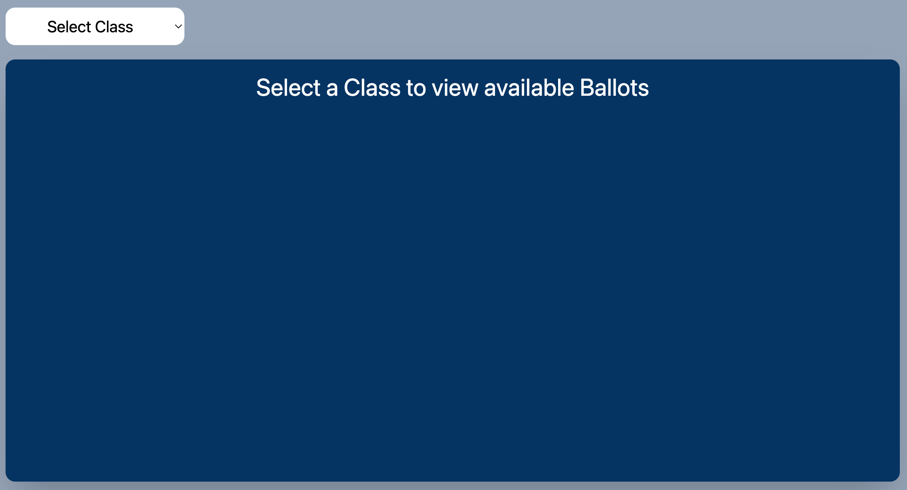
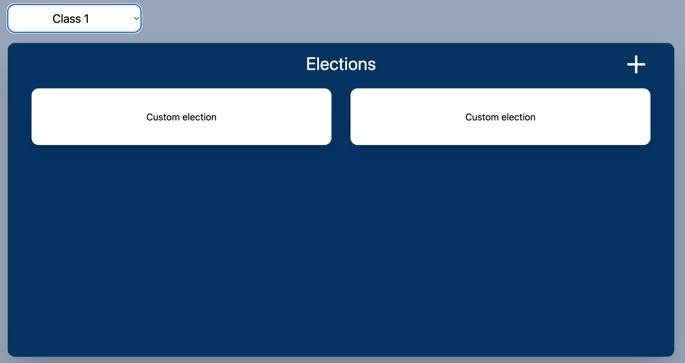
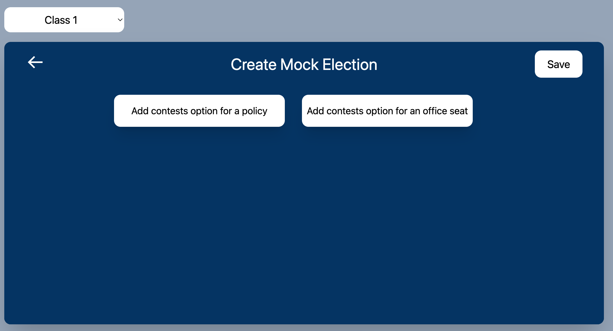

# Mock Elections Page

The mock elections page is for teachers to create ballots for their students to vote on. 

## Viewing already created ballots
When a teacher selects the page they will prompted to select a class. 
Upon selection of a class they will see all created ballots for the respective class. 

## Creating a new ballot
At the top right there is a plus button that allows the creation of a new ballot. 
Clicking the plus button will display a new component that has:
 * Back arrow
 * Save button
 * Two buttons to add a contests for policy or for candidate. 

### Page breakdown
The main page uses two components:

* [MockElectionCard.jsx](./Components/MockElectionCard.md)
* [CreateBallot.jsx](./Components/CreateBallot.md)

Once create ballot is selected, all components utilized can be found in the [BallotFrom.jsx] page.
Which consists of:

* [CandidateForm]()
* [PolicyForm]()
* [CandidateButton]()
* [PolicyButton]()